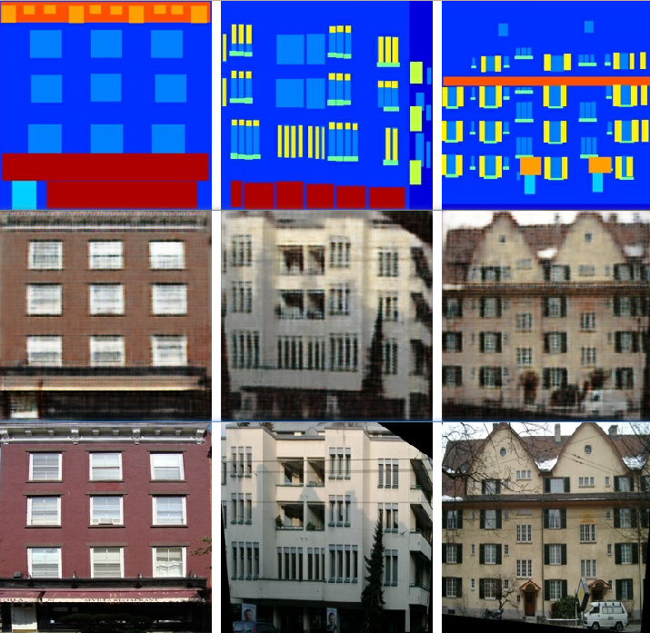
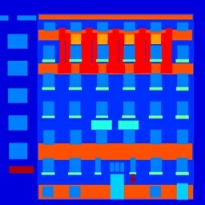
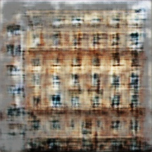
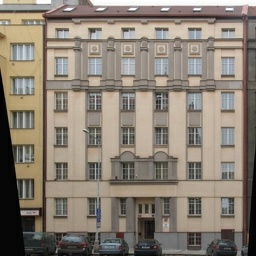

# pix2pix 基于tensorflow的实现
## 参考：
[Paper](https://affinelayer.com/pix2pix/)

代码主要参考:https://github.com/affinelayer/pix2pix-tensorflow

主要是加了一些中文注释，api有改动的地方已经修复。去掉了一些对图片翻转、平移之类的操作。更简洁一些，适合新手查看。

数据集：https://people.eecs.berkeley.edu/~tinghuiz/projects/pix2pix/datasets/

这里选用的是facades
## 环境：
 - python 3.6.1
 - tensorflow 1.3.0

## 运行：
 - 测试：
 ```sh
 python ./pix2pix.py your_input_dir your_output_dir --mode test --batch_size 4 --checkpoint your_checkpoint_dir --ngf 16 --ndf 16
```
 - 训练：
```sh
python ./pix2pix.py your_input_dir your_output_dir --mode train --max_steps 500 --summary_freq 10 --progress_freq 10 --batch_size 4 --ngf 16 --ndf 16
```
## 效果：

由于只是示例，采用的数据量较少，训练的step也较少，导致最后效果并不是很好。但是大体效果是有的。

训练结果（从上到下依次是：输入、输出、真实图片）：


测试结果：

输入：



输出：



真实图片：




## PS

tensorboard 很6


